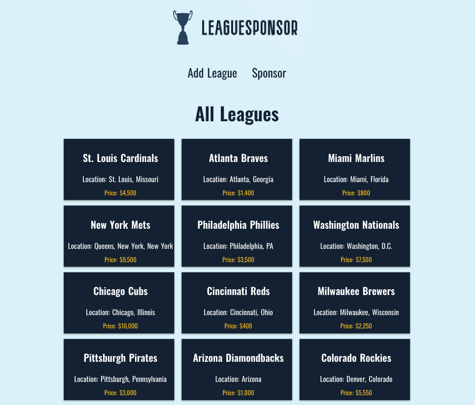
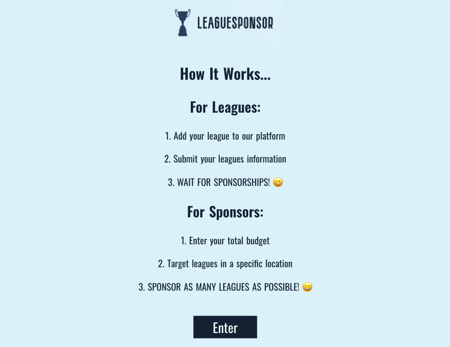
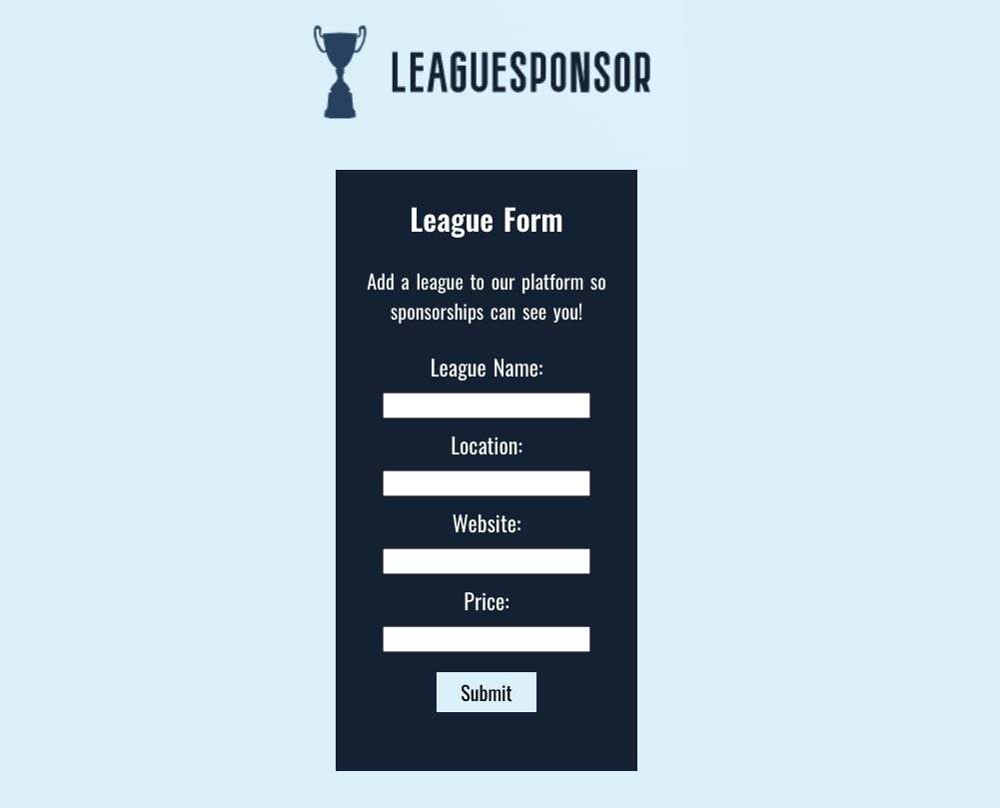
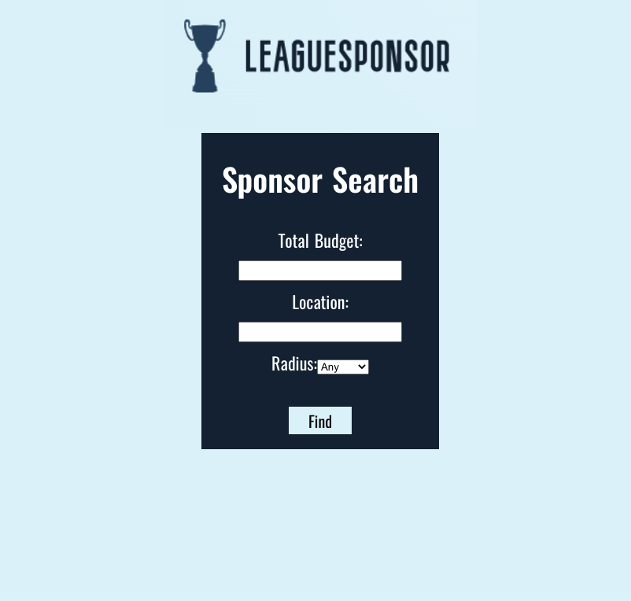
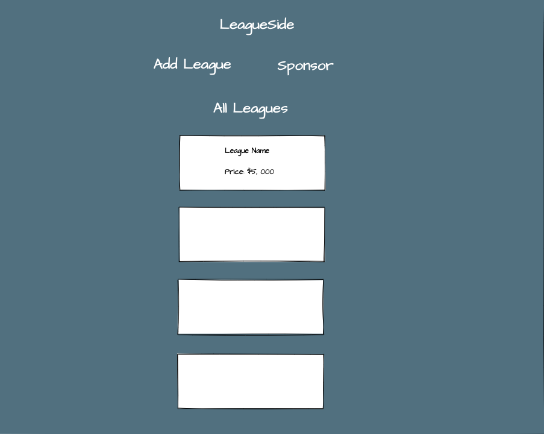
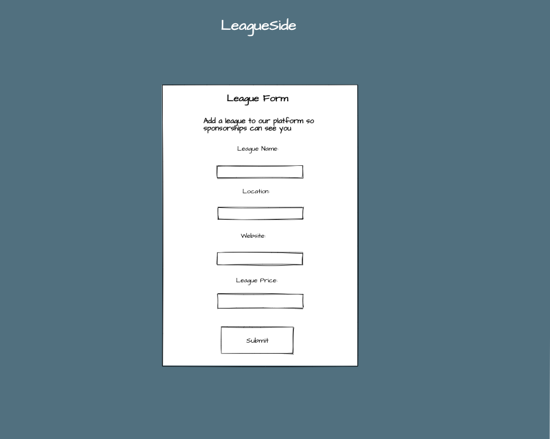
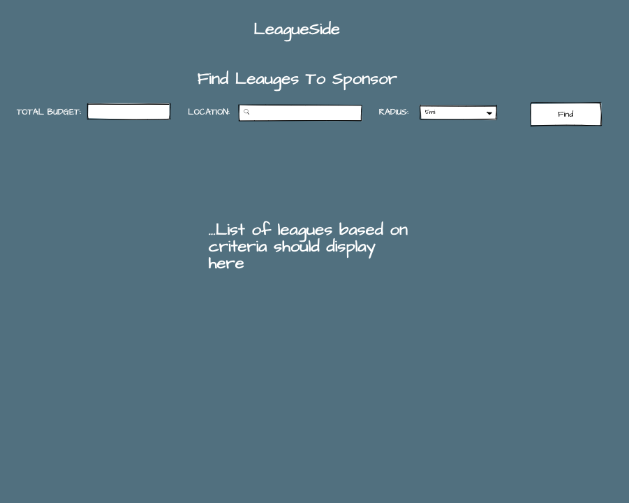

# LeagueSponsor 🏆

-  [LeagueSponsor](https://leaguesponsor.oliviadavis593.vercel.app/) is a fully responsive full-stack React application designed for the LeagueSide company tech interview! The backend repo can be found [here](https://github.com/oliviadavis593/LeagueSponser-API).

## How to use the app 📓
Two options are possible in the application: Create a league or find leagues to sponsor. 

### Creating a league 
- All you have to do is put in the criteria it asks of you. 

### Finding a league to sponsor 
- For the data that is in the database I would suggest looking for this 
```
1. Enter a total budget 
2. Enter latitude: in progress...
3. Enter longitude: in progress...
4. Enter a radius: Only option for now is 5mi

```

## Screenshots 📸
|  |
|:---:|
|Dashboard|

|  |  | 
|:---:|:---:|:---:|
|Landing|League Form|Sponsor Page|

## Wireframe 🛠
- I always start with a wireframe first approach before moving into planning the React component layout. This acutally aides in figuring out how my app will be layed out beforehand.

|  |
|:---:|

|  |  | 
|:---:|:---:|:---:|

## Tech Used 🖥
**Front-End**
- HTML5
- CSS3 
- [React](https://reactjs.org/) (Javscript Framework)

**Back-End**
- [Node](https://nodejs.org/en/) (JavaScript runtime environment)
- [Express](https://expressjs.com/) (web application framework for Node.js)
- [PostgreSQL](https://www.postgresql.org/) (Relational Database Management System)

**Testing and Deployment**
- [Enzyme](https://github.com/enzymejs/enzyme) (Front-End Framework Testing)
- [Mocha](https://mochajs.org/) (Back-End Framework Testing)
- [Chai](https://www.chaijs.com/) (Assertion Library For Node)
- [Vercel](https://vercel.com/) (cloud platform for static sites and Serverless Functions)
- [Heroku](https://www.heroku.com/platform) (Cloud PaaS)