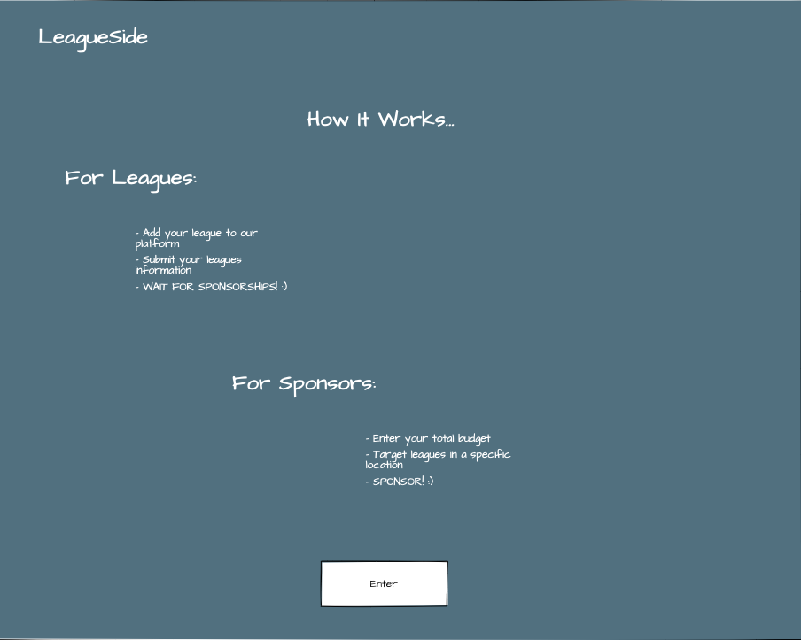

# LeagueSponsor 🏆

-  [LeagueSponsor]() is a full-stack React application designed for the LeagueSide company tech interview!

# Screenshots 📸
|  |
|:---:|
|Landing|

|  |  | 
|:---:|:---:|:---:|
|Dashboard|League Form|Sponsor Page|

# Wireframe 🛠
- I always start with a wireframe first approach before moving into planning the React component layout. This acutally aides in figuring out how my app will be layed out beforehand.

|  |
|:---:|

|  |  | 
|:---:|:---:|:---:|

# Tech Used 🖥
**Front-End**
- HTML5
- CSS3 
- [React](https://reactjs.org/) (Javscript Framework)

**Back-End**
- [Node](https://nodejs.org/en/)
- [Express](https://expressjs.com/)
- [PostgreSQL](https://www.postgresql.org/) (Relational Database Management System)

**Deployment**
- [Vercel](https://vercel.com/) (cloud platform for static sites and Serverless Functions)
- [Heroku](https://www.heroku.com/platform) (Cloud PaaS)